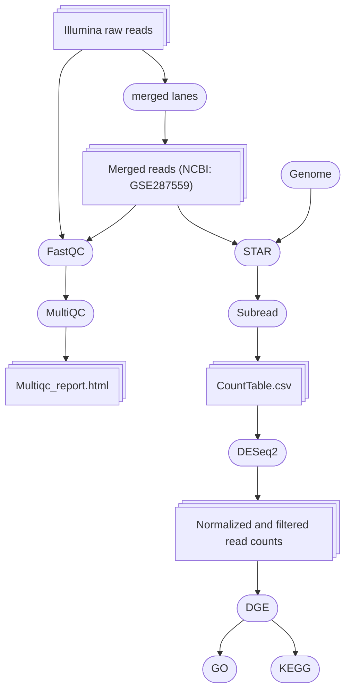

# RNAseq analysis of cold-adapted _Argiope bruennichi_ spiderlings from the edge of the distribution in Estonia subjected to three overwintering regimes.

## List of files 

1. Bioinformatic_bash.md -- script for sequence data processing from raw reads to count table.
2. Multiqc_report.html -- MultiQC report on the quality of merged reads
3. CountTable.csv -- gene counts output from STAR and FeatureCounts (Subread).
4. SampleFile.txt -- information about the samples, including the replicates and samples submitted to NCBI.
5. DESeq_analysis.R -- Script for the differential expression analysis
6. GO_analysis.R -- Gene Ontology analysis
7. GO_analysis_combined_results.csv -- all GO found for the differentially expressed genes
8. KEGG.R -- Kyoto Encyclopedia of genes and genomes pathway analysis
9. KEGGresults.csv -- all KEGG found for the differentially expressed genes
10. SruvivalAllEggSacs.csv -- data for survival proportion of all egg sacs
11. Survival_model.R -- script survival proportion
12. FatContent.csv -- data for fat content
13. FatContent_model.R -- script for fat content 
14. FA_results.csv -- Fatty acids per sample 
15. FA_analysis.R -- Script for fatty acid analysis 

## Used programs 

- [FastQC](https://www.bioinformatics.babraham.ac.uk/projects/fastqc/) 0.12.0 and [MultiQC](https://github.com/MultiQC/MultiQC) v1.14 -- quality reports for raw reads
- [STAR](https://github.com/alexdobin/STAR) 2.7.11a -- Spliced Transcripts Alignment to a genome Reference
- [Subread](https://github.com/ShiLab-Bioinformatics/subread) 2.0.6 -- for processing next-gen sequencing data with featureCounts read summarization program

### R packages 
- [DESq2](https://genomebiology.biomedcentral.com/articles/10.1186/s13059-014-0550-8) 1.38.3 -- Normalization of read counts and DGE analysis
- [topGO](https://bioconductor.org/packages/release/bioc/html/topGO.html) 2.56.0 -- Enrichment Analysis for Gene Ontology
- [clusterProfiler](https://bioconductor.org/packages/release/bioc/html/clusterProfiler.html) 4.10.0 -- Exploring functional characteristics of coding genomics data for the annotated genome.
- [ComplexHeatmap](https://bioconductor.org/packages/release/bioc/html/ComplexHeatmap.html) 2.22.0 -- Creates complex heatmaps efficiently to visualize associations between different sources of data sets and reveal potential patterns.
- [VennDiagram](https://cran.r-project.org/web/packages/VennDiagram/index.html) 1.7.3 --  calculate and plot high-resolution Venn and Euler plots
- [glmmTMB](https://cran.r-project.org/web/packages/glmmTMB/index.html) 1.1.10 -- Generalized Linear Mixed Models using Template Model Builder, using maximum likelihood estimation. 
- [DHARMa](https://cran.r-project.org/web/packages/DHARMa/index.html) 0.4.7 -- residual diagnostics for hierarchical (multi-level/mixed) regression models
- [emmeans](https://cran.r-project.org/web/packages/emmeans/index.html) 1.10.6 -- estimated marginal means (EMMs) for the generalized linear mixed models

## Pipeline RNAseq data analysis

